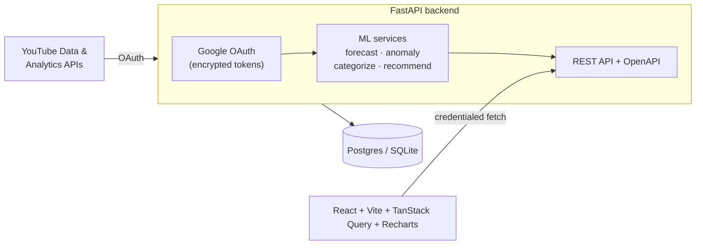

<div align="center">

<!-- Replace with your generated banner (see prompt in the PR/README notes). -->


# Profitly — Revenue Intelligence for YouTube Creators

**The question YouTube Studio won't answer: _which of my videos actually made money, and what should I make more of?_**

### 🔗 [**Live demo →**](https://prof-yt.vercel.app)

[](https://prof-yt.vercel.app)
[](https://github.com/aquib6010/profYT/actions/workflows/ci.yml)


<sub>Backed by a free instance — the first load may take ~30–60s to wake.</sub>

</div>

---

Profitly is a full-stack analytics platform that layers production-grade ML on a creator's
per-video, per-day YouTube revenue: **calibrated earnings forecasts**, **explained anomaly
alerts**, **automatic content categorization**, and **causal "make more of this"
recommendations** — each benchmarked against a baseline and shipped with honest uncertainty.

It's built around one idea the growth-tool ecosystem ignores: the videos that get **views**
are usually not the videos that make **money** — and creators optimize for the wrong one.

## Demo

> Runs on a synthetic dataset with *planted ground truth*, so every model can be scored
> against known answers. Connect a real channel via Google OAuth to use live data.

<!-- Capture real screenshots from the running app and drop them in docs/. -->
| Dashboard | Landing |
|---|---|
|  |  |

## What it does

Each feature leads with the question it answers — the ML sophistication is the footnote.

| | Question it answers | Approach |
|---|---|---|
| 📈 **Revenue forecast** | "What will I earn next 30 days?" | Damped Holt-Winters **ETS**, selected by walk-forward CV over a model ladder; **conformal** prediction intervals |
| 🚨 **Anomaly detection** | "What just broke, and why?" | **Isolation Forest** + **PELT** changepoints + **KL-divergence** audience-mix attribution |
| 🏷️ **Content categorization** | "What kind of videos are these?" | Zero-shot **MiniLM** sentence embeddings + prototype cosine |
| 💡 **Uplift recommendations** | "What should I make more of?" | **Doubly-robust AIPW** causal estimation + bootstrap confidence intervals |

## ML approach & results

Models are chosen by evidence, not assumption — full numbers in
**[EVALUATION.md](EVALUATION.md)** and **[MODEL_CARD.md](MODEL_CARD.md)**, with the analysis
reproduced in **[`notebooks/`](notebooks/)**.

| Service | Headline result (seed data) | Honesty note |
|---|---|---|
| Forecast | Damped ETS: **MAE $1.46 @ 14d, ~10% better than naive**; LightGBM overfits and loses | A *damped* trend is what beats naive; conformal coverage verified out-of-sample |
| Anomaly | Detects the planted day-60 shift: **"CPM −22.9% — audience US −25pts, IN +29pts"** | Changepoint anchored on audience mix, not CPM (CPM is too noisy) |
| Categorization | Zero-shot, **~74% from titles alone** (94% with full metadata) | The 94% leaks the label via synthetic descriptions — 74% is the honest number |
| Uplift | Tutorials **+$26/video** (90% CI excludes 0) | Adjusting for reach *raises* the estimate ($11 → $26) — naive understates it |

> The recurring theme — *"I benchmarked the complex models and the simple one won, and here's
> the proof"* — is deliberate. The evaluation is the product.

## Architecture



## Tech stack

**Backend** — Python 3.11 · FastAPI · SQLAlchemy 2 (async) · Alembic · Pydantic v2
**ML** — pandas · NumPy · scikit-learn · statsmodels · LightGBM · ruptures · sentence-transformers
**Frontend** — React 18 · Vite · TypeScript · TanStack Query · Recharts · Tailwind
**Infra** — Postgres (Supabase) / SQLite · GitHub Actions CI (ruff · mypy · pytest)

## Getting started

### Prerequisites
Python 3.11+, Node 20+. (Google Cloud OAuth credentials only needed for *real* YouTube data;
the seed dataset works without them.)

### Backend
```bash
cd backend
python -m venv .venv
.\.venv\Scripts\Activate.ps1      # Windows  (source .venv/bin/activate on macOS/Linux)
pip install -r requirements.txt
copy .env.example .env            # then fill in values (see below)
alembic upgrade head
python -m app.scripts.seed        # generates the demo dataset
uvicorn app.main:app --reload     # http://localhost:8000  (docs at /docs)
```

### Frontend
```bash
cd frontend
npm install
copy .env.example .env
npm run dev                       # http://localhost:5173
```

### Google OAuth (only for live YouTube data)
1. [Google Cloud Console](https://console.cloud.google.com/) → new project.
2. Enable **YouTube Data API v3**, **YouTube Analytics API**.
3. OAuth consent screen (External) → add scopes `youtube.readonly`,
   `yt-analytics.readonly`, `yt-analytics-monetary.readonly`, `userinfo.email`,
   `userinfo.profile`; add yourself as a test user.
4. Create an OAuth **Web** client; redirect URI `http://localhost:8000/auth/google/callback`.
5. Put the client ID/secret in `backend/.env`.

> `yt-analytics-monetary.readonly` is required for revenue data.

## Notebooks

The analysis behind the models — they import the **production code** and run on a CSV export,
so they're reproducible without a database. See **[`notebooks/README.md`](notebooks/README.md)**.

| Notebook | Shows |
|---|---|
| `01_eda` | Dataset structure: seasonality, category economics, the audience shift |
| `02_revenue_forecasting` | Model ladder, walk-forward CV, why damped ETS wins, conformal bands |
| `03_anomaly_detection` | Isolation Forest + PELT + KL attribution |
| `04_categorization_and_uplift` | Zero-shot categorization + AIPW uplift (naive vs adjusted) |

## Testing & quality

```bash
cd backend
ruff check app tests     # lint
mypy app                 # type-check
pytest -q                # 23 tests (ML services + API/auth)
```
CI runs all three on every push via [GitHub Actions](.github/workflows/ci.yml).

## Project structure

```
profYT/
├── backend/                 FastAPI + SQLAlchemy + ML services
│   └── app/
│       ├── api/             REST endpoints (auth, analytics, videos, forecast, anomaly, recommend)
│       ├── auth/            Google OAuth + Fernet token encryption
│       ├── models/          SQLAlchemy 2 async models
│       ├── schemas/         Pydantic response models
│       └── services/        ML: forecast · anomaly · categorize · recommend
├── frontend/                React + Vite + TS + Tailwind (landing + dashboard)
├── notebooks/               Reproducible analysis (jupytext-paired)
├── EVALUATION.md            Backtest results
└── MODEL_CARD.md            Per-model assumptions, metrics, limitations
```

## Roadmap

- ✅ OAuth, per-video revenue, all five analytics surfaces, evaluation, tests, CI
- 🔜 Live deployment (Railway + Vercel); real YouTube ingestion worker + token refresh
- 🔭 Enable Prophet (benchmark vs ETS), SHAP-based anomaly attribution, EconML validation of AIPW

## Note on data
The demo uses a **synthetic** dataset built with planted ground truth (weekly seasonality,
content-category economics, a day-60 audience shift) so models can be evaluated against known
answers. Numbers reflect that synthetic data, not a real channel.

## License
MIT
